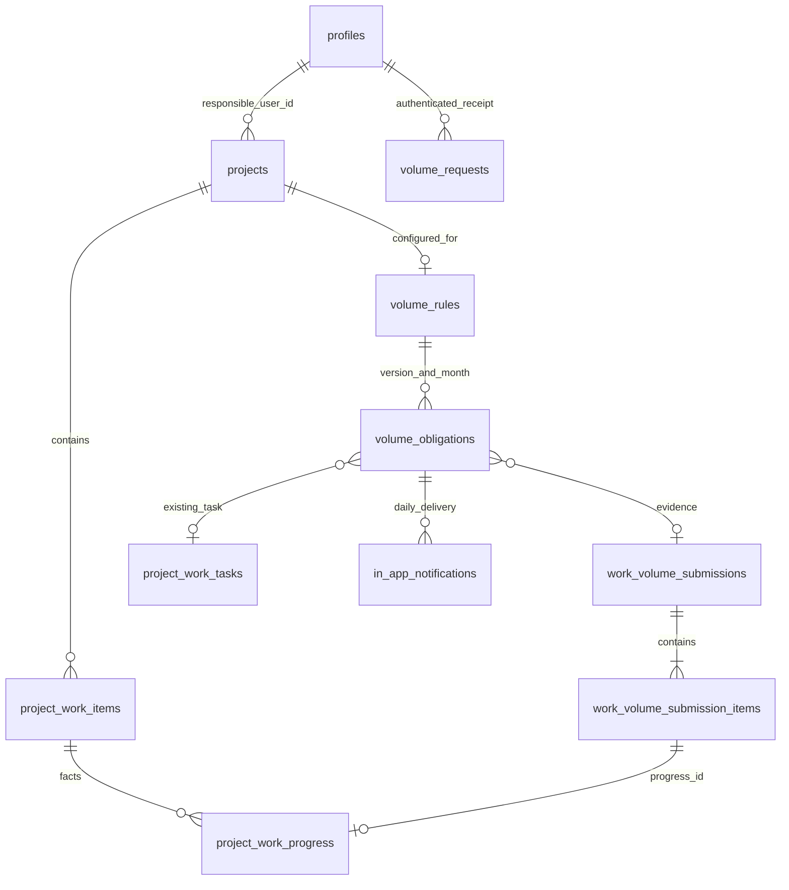

# Архитектура первого реализованного этапа

Единый существующий main-agent остаётся главным помощником. Новые предметные команды пока вызываются интерфейсом; автоматическая запись моделью в них не подключена. Новые записи работ и денег не создают параллельного учёта: факты остаются в прежних таблицах.

`volume_rules`, `volume_obligations`, `volume_requests` находятся в `voltmaster_private`: RLS включена, прямые клиентские grants отсутствуют. Public RPC являются SECURITY INVOKER обёртками узких приватных функций. Приватные SECURITY DEFINER нужны для контролируемой транзакции на старых таблицах и чтения закрытого списка директоров; они имеют фиксированный пустой search_path, проверяют auth.uid, активность и область доступа. Клиент не передаёт инициатора, created_by или SQL.

## Матрица новых команд

| Операция | Доверенный активный директор | Другой активный пользователь | Анонимный / неактивный |
| --- | --- | --- | --- |
| Подача/замена/удаление объёмов | Все объекты | Только responsible_user_id = auth.uid | Запрет |
| Настройка регламента | Да, через закрытый allowlist | Запрет | Запрет |
| Мои задачи | Собственные | Собственные | Запрет |
| Чтение уведомлений | Собственные | Собственные | Запрет |
| Запуск планировщика с произвольными часами | Только PostgreSQL/Cron | Запрет | Запрет |
| Прямое чтение/изменение закрытых таблиц | Клиенту запрещено | Запрет | Запрет |

Все существующие широкие политики остаются прежними до согласования их изменения. Это ограничивает общую безопасность приложения, хотя новые полномочия проверяются отдельно.

## Контракты

- `submit_work_volumes(p_request uuid, p_payload jsonb)`: operation save/delete, project_id, submission_id и expected_updated_at для замены/удаления; даты периода, комментарий, items для save. Строка содержит work_item_id, completed_volume, progress_date, unit_count, section_label. Строгие поля, 1–500 строк, положительный конечный numeric, целый unit_count, работа того же объекта, дата внутри периода, без дублей. Возвращает фактический результат и данные для замены локального состояния. Идемпотентность по (auth.uid, p_request) с точным JSONB payload. Потерянный ответ можно повторить; при изменении версии нужен reload. Удаление подтверждает человек в текущем интерфейсе. Модель пока не имеет этого инструмента.
- `configure_volume_obligation(p_config jsonb)`: явные настройки и expected_version; директор является инициатором. Ответственный обязан совпадать с карточкой проекта и иметь активный аккаунт. Изменение версии отменяет старые незавершённые обязательства. Бизнес-параметры не подставляются.
- `get_my_volume_obligations()`: собственные обязательства с основанием, сроком, статусом, ссылкой на существующую задачу и доказательство; настройки видит только доверенный директор. Стоимости не возвращаются.
- `read_in_app_notification(p_id uuid)`: только собственная запись; идемпотентный read_at без изменения задачи.
- `voltmaster_private.run_volume_obligations(p_now, p_rule)`: PostgreSQL-only; p_rule нужен для изолированных тестов, Cron обрабатывает все активные правила с серверным временем. Одно транзакционное advisory locking, уникальные ограничения экземпляра и доставки. Сбой откатывает запуск; следующий запуск повторяет его без дублей.

Текущие фиксированные напоминания полностью выполняются SQL. Один запуск создаёт только сегодняшнее уведомление, даже после многодневного простоя. Выполнение оценивается до доставки. Источник доказательства проверяется против закрытой квитанции с автором, точным состоянием подачи и всех строк.

## Совместимость и переход

Существующий интерфейс можно вернуть без удаления схемы: новые таблицы добавочные, новые функции не меняют старые политики/данные. Перед возвратом старого интерфейса отключить созданные регламенты настройкой; фоновые обязательства существуют независимо от чата. Полный SQL rollback с удалением истории не выполняется. Сохранённые квитанции и обязательства не связаны FK с сообщениями/протоколом и не затрагиваются их очисткой.

Каталог строгих предметных инструментов и долговременная очередь подключены к main-agent v6. Модули загружаются по запросу модели из `supabase/functions/main-agent/modules.ts`; полный schema.ts не отправляется с каждым запросом. Отдельные агенты не запускаются. Сервер проверяет владельца, активность и доступ независимо от модели.

## Файлы и фоновые разборы

agent-files принимает PDF/TXT в закрытый bucket agent-files, проверяет формат, размер, страницы, владельца чата и SHA256. Максимум 8 MiB, 40 страниц PDF, 120 000 символов TXT; лимит владельца 100 файлов/100 MiB. Файлы не связаны FK с очищаемым чатом. Signed URL действует 60 секунд; доступ проверяется по владельцу либо назначению/директорскому доступу к прикреплённому объекту.

agent_background_jobs сохраняет очередь; agent_job_steps — контрольные точки. Cron раз в минуту обращается к agent-worker только при наличии работы. JWT шлюза worker отключён для Cron, но worker требует отдельный секретный токен из закрытой таблицы, проверяемый серверным RPC до захвата задания. Токен клиенту и модели не выдаётся. Worker читает по две страницы PDF через существующий OpenAI API, сохраняет абсолютные страницы, цитаты, методы производных количеств, неизвестные значения и needs_review. Результат является черновиком.

Lease и уникальные шаги защищают от параллельных повторов. Потеря ответа потенциально оплаченного запроса переводит задачу в needs_attention без автоматического повторного вызова. Сейчас доступны статус и отмена; специальное продолжение needs_attention предстоит. Лимиты: три активных задания, десять в сутки, двести в месяц; также ограничены токены и шаги. Закрытие браузера не прерывает очередь.

agent_file_action_plans сохраняет точный план создания объекта/прикрепления и SHA256. Только сообщение того же доверенного директора в том же чате с точным `ПОДТВЕРЖДАЮ <UUID>` разрешает транзакционную запись объекта, документа, версии и связи. Повтор не создаёт дубликат. Категория project добавлена в документы; исходник сохраняется в agent-files.

Инструменты возвращают разрешённый производственный контекст, денежные суммы директору, точную арифметику заданных цен, собственные задачи, файлы и статусы. Денежные суммы не являются прибылью. Закрытый agent_tool_runs фиксирует вызовы. Интернет-поиск, подтверждённый импорт ведомости, бюджетные версии, серверные PDF/КП и утверждённые формы пока не реализованы.
